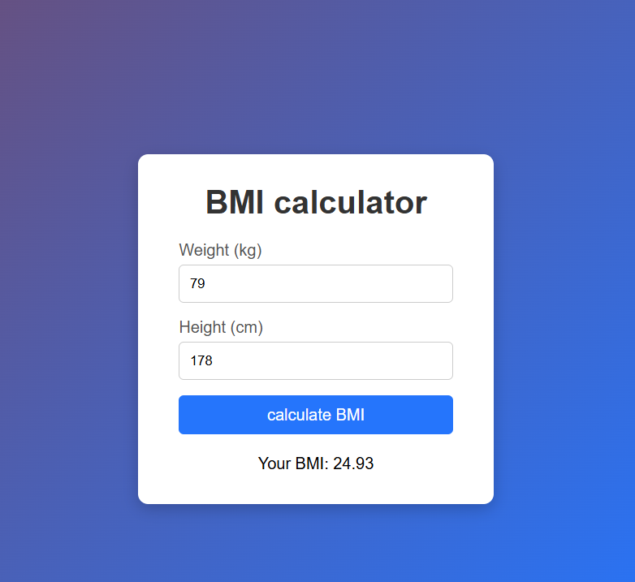

# Accenture Interview Question

This BMI Calculator was a question from Accenture’s recent Round 3 assessment Web Development question.
The task tested candidates’ ability to implement a simple, functional web application using HTML, CSS, and JavaScript, focusing on clean UI design and DOM manipulation without using external libraries.

---

## 🧮 BMI Calculator

 A simple BMI (Body Mass Index) Calculator built using HTML, CSS, and JavaScript.
This project was created as part of a recent Accenture interview question, focusing on basic web development fundamentals and DOM manipulation.

---

## Reference Screenshots



---
## 🚀 Features

  - Input height (cm) and weight (kg) to calculate BMI instantly.
  - Real-time result display without page reload.
  - Validates user input for correct numeric values.
  - Clean and responsive UI built using pure HTML and CSS.
    

## 🛠️ Technologies Used
  - HTML5 – Structure of the webpage
  - CSS3 – Styling and layout
  - JavaScript (Vanilla JS) – Logic and DOM manipulation

## 📂 Project Structure
```
.
├── index.html
├── style.css
└── index.js
```
🧑‍💻 Usage

## Clone the repository:
```
git clone https://github.com/<your-username>/bmi-calculator.git
```

Open index.html in your browser.

Enter height and weight → click Calculate BMI.
